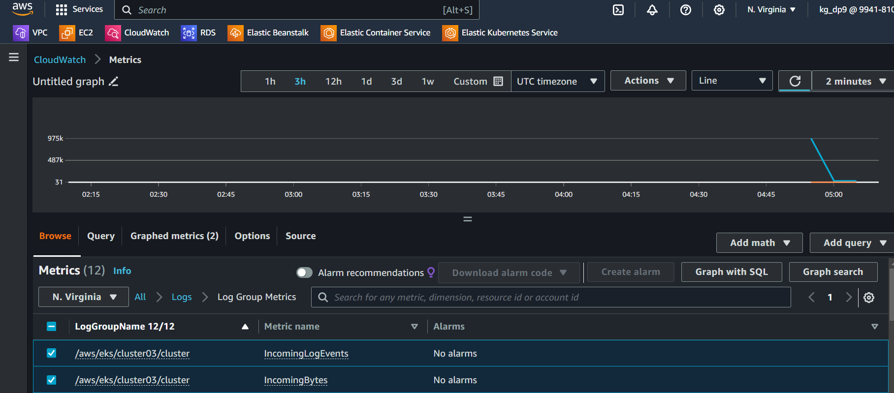

# Ecom Application Deployment on AWS Network with EKS

### November 18, 2023

## Table of Contents
- [Purpose](#purpose)
- [Infrastructure Diagram](#infrastructure-diagram)
- [Jenkins Infrastructure (ec2.tf)](#jenkins-infrastructure-ec2tf)
- [Credentials for Jenkins](#credentials-for-jenkins)
- [Application Infrastructure Resources](#application-infrastructure-resources)
- [Jenkins Pipeline](#jenkins-pipeline)
- [Data](#data)
- [Monitoring](#monitoring) 
- [Troubleshooting](#troubleshooting)
- [Optimization](#optimization)
- [Conclusion](#conclusion)

## Purpose

The primary goal of this deployment is to leverage Kubernetes to deploy a robust e-commerce application within the AWS network. Automation is introduced by Terraform and Jenkins to streamline the provisioning of the application's architecture. To enhance security, the application’s containers are launched in private subnets. Workload distribution and accessibility are ensured through the deployment of a load balancer. Configuration details, such as accessible ports and desired states, are declared in YAML files.

This setup aims to establish a resilient and scalable infrastructure for the e-commerce application, optimizing performance and scalability during traffic spikes, and addressing disaster recovery scenarios.

## Infrastructure Diagram

## Jenkins Infrastructure (jenkins.tf)
The infrastructure for Jenkins is defined in the [ec2.tf](jenkinsenv/jenkins.tf) file. This infrastructure consists of three EC2 instances:

1. **Jenkins Manager**: This instance is responsible for managing and controlling the worker nodes.
2. **Docker Node / Terraform**: This node is equipped for tasks such as testing the application, building the Docker image, and pushing the image to Docker Hub. Terraform then provisioned the application infrastructure 
3. **EKS Node**: This Jenkins node handles the creation of the EKS cluster and the application's EKS worker nodes. The configuration is based on the deployment, service, and ingress YAML files.

[Scripts](jenkinsenv/jenkins.sh) have been prepared to install the necessary files on each instance.

## Credentials for Jenkins
To ensure Terraform has the necessary access to AWS, it requires both AWS access and secret keys. Since the main.tf files are hosted on GitHub but shouldn't have public access for security reasons, Jenkins credentials are created for AWS. Similarly, credentials are created for Docker Hub with a username and password:

For AWS:

- Navigate to **Manage Jenkins > Credentials > System > Global credentials (unrestricted)**.
- Create two credentials for access and secret keys as "Secret text."

For Docker Hub:

- Navigate to **Manage Jenkins > Credentials > System > Global credentials (unrestricted)**.
- Create credentials for access and secret keys using DockerHub-generated key and username.

For Slack Webhook:

- Navigate to **Manage Jenkins > Credentials > System > Global credentials (unrestricted)**.
- Create credentials for access and choose the appropriate credential type "Secret text" for a simple secret to place the URL.

## Application Infrastructure Resources

### vpc.tf
The Jenkins node previously created will use Terraform to launch the application's infrastructures in the US East region. The infrastructure includes the following resources in the [vpc.tf](initTerraform/vpc.tf) :

- **Virtual Private Cloud (VPC)**: The networking framework that manages resources.
- **Availability Zones (2 AZs)**: Providing redundancy and fault tolerance by distributing resources across different AZs.
- **2 Public Subnets**: Hosts the NAT gateway for egress traffic from the private subnet
- **2 Private Subnets**: Subnets isolated from the public internet, for sensitive data
- **Internet Gateway**: Entry point for traffic into the VPC
- **NAT Gateway**: A network gateway for egress traffic from private subnets to the internet.
- **2 Route Tables**: Routing rules for traffic between subnets, NAT, and IGW

## Jenkins Pipeline

<strong>Pipeline Steps</strong>

<strong>Test Stage (docker_node)</strong>

In these stages, the front end and back end are tested on the `docker_node` EC2 instance. Any errors are identified and addressed during this phase.

<strong>Build Stage (docker_node)</strong>

The build stage focuses on building the Docker images. The Dockerfiles are used to create a container image that encases the application and its dependencies. The images serve as a consistent package for the application's front and back end.

<strong>Login to Docker Hub (docker_node)</strong>

After the images are built, they will get pushed by logging into Docker Hub. This is made possible through credentials installed on Jenkins, allowing for secure interactions with the Docker Hub service.

<strong>Push to Docker Hub (docker_node)</strong>

Once the images are successfully created, they are pushed to the Docker Hub repository. This step makes the Docker image available for distribution and deployment.

<strong>Deploy</strong>

The Deployment stage consists of applying the YAML files on the `kubernetes` EC2 instance. The front-end and back-end components have their own set of distinctive deployment and service YAML files. In the `deployment.yaml` file, container configuration details, such as the image and port, are specified. The service YAML file configures how users can access the application after entering through the ingress manifest.

## Data

#### Create a diagram of the schema and relationship between the tables (keys). [Schema Diagram](https://github.com/andmulLABS01/Deployment_9/blob/main/Results/Schema.md)

#### What is the distribution of the amount of products ORDERED?  How much revenue would each product have generated IF the order was completed? 

  
<strong>Distribution Data</strong>

  - [Distribution Visual](https://github.com/andmulLABS01/Deployment_9/blob/main/Results/Visualization_1.pdf)
  - [Distribuiton CSV](https://github.com/andmulLABS01/Deployment_9/blob/main/Results/solution_1.csv)

#### Which states ordered the most products? Least products?  How does the revenue generated compare to the amount of products sold?  What were the top 5 products sold in each of those states? 

  
<strong>State and Product Data</strong>

  
  - [State and Product Visual_A](https://github.com/andmulLABS01/Deployment_9/blob/main/Results/Visualization_2A.pdf)
  - [State and Product Visual_B](https://github.com/andmulLABS01/Deployment_9/blob/main/Results/Visualization_2B.pdf)
  - [State and Product CSV_A](https://github.com/andmulLABS01/Deployment_9/blob/main/Results/solution_2A.csv)
  - [State and Product CSV_B](https://github.com/andmulLABS01/Deployment_9/blob/main/Results/solution_2B_Top5.csv)

#### There are orders that were placed that weren't paid for.  Those shouldn't have been shipped out.  How much money did this company lose by delivering products that were not paid for?  How does this compare to how much revenue would have been generated?  

  
<strong>Lost Revenue Data</strong>

  - [Lost Revenue Visual](https://github.com/andmulLABS01/Deployment_9/blob/main/Results/Visualization_3.pdf)
  - [Lost Reveune CSV](https://github.com/andmulLABS01/Deployment_9/blob/main/Results/solution_3.csv)

#### Taking into consideration that some orders were not completed, how much money was ACTUALLY generated compared to the answer from Question 1?  

  
<strong>Money ACTUALLY generated Data</strong>

  - [Money ACTUALLY generated Visual](https://github.com/andmulLABS01/Deployment_9/blob/main/Results/Visualization_4.pdf)
  - [Money ACTUALLY generated CSV](https://github.com/andmulLABS01/Deployment_9/blob/main/Results/solution_04.csv)

## Monitoring
To enhance the monitoring capabilities and maintain native integration within the AWS ecosystem, we've leveraged AWS CloudWatch. This service provides comprehensive insights into application performance, allowing us to proactively address issues and minimize disruptions.

## Troubleshooting

<strong>Issues</strong>

#### Problem1: Frontend test stage NodeJS defaulting to wrong version
##### Solution1: Install and use NVM to control what version of Node runs 

#### Problem2: Frontend test stage hanging 
##### Solution2: use `nohup` to start

#### Problem3: Frontend test stage taking 3+ minutes with `npm install`
##### Solution3: Switch to `npm ci` which is used for speeding up CICD specifically

#### Problem4: Frontend test stage using curl to get 200/300 response fails and returns 000
##### Solution4: Write the output of `nohup npm start` command to a file and use `grep` to search for success Messages

#### Problem5: Continuous building of Docker images taking up too much space on agents 
##### Solution5: Remove all images at begining of pipeline runs except ones tagged with "latest"

#### Problem6: Frontend test stage application directory already exists
##### Problem6: Clean up directories and running processes at begining of pipeline run  

#### Problem7: Images building from cache, not reflecting updates
##### Solution7: Add --no-cache flag to `docker build` commands 

#### Problem8: IP address changes when instance stops which breaks the curl command to test backend app  
##### Solution8: Install AWS CLI on Docker agent and get IP dynamically 

#### Problem9: ENV variable for IP not passing between seperate 'sh' blocks in BuildTestBackend stage
##### Solution9: Use a single sh block to fun all 'sh' commands within the same context

#### Problem10: Getting 404 when using  curl -f http://$IP:8000
##### Solution10: Look at Django 404 page and curl a valid endpoint [curl -f http://$IP:8000/api/products/]

## Optimization
**Geographical Redundancy**: Duplicating the entire infrastructure in a different AWS region would further increase resilience. This provides a failover in case a whole region experiences an outage, ensuring continued availability of the application.
## Conclusion

In conclusion, deploying this e-commerce application on Kubernetes within the AWS network not only optimizes performance and scalability but also introduces fault tolerance and disaster recovery benefits. With Kubernetes' automated healing features, the system ensures that in the event of a worker node EC2 failure, a replacement is seamlessly deployed without the need for manual configuration, enhancing overall system resilience. The application management takes a declarative approach, paired with load balancing, to create an adaptable environment for the application. The seamless integration of Kubernetes, Terraform, and Jenkins forms a robust solution, for scalability, operational efficiency, and effective management.
